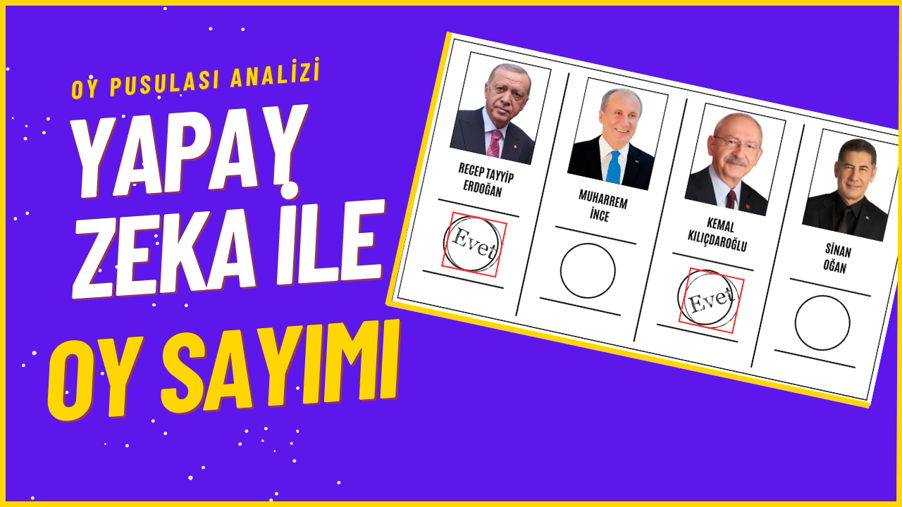

# AI VOTE COUNTER - YAPAY ZEKA İLE OY SAYIMI
Bu projede oy pusulası tespiti yapıp geçerli veya geçersiz olan oyları tespit ediyorum. 

## Darknet Kurulumu

`git clone https://github.com/AlexeyAB/darknet`

##Makefile dosyasını düzenleyin:  
`GPU=1`  
`CUDNN=1`  
`CUDNN_HALF=1`  
`OPENCV=1`  
`LIBSO=1`

NOT: ARCH değerini ekran kartınızın compute capability değerine göre ayarlayın.
  
`sudo apt install libopencv-dev`  
`pip install opencv-python`  
`cd darknet`  
`make`

Kurulum tamamlandı. Diğer gereksinimleri kuralım: 
`pip install pillow` 
`pip install imutils` 

## Dataset oluşturun:
Dataseti oluşturun: 
`python create-ballot-dataset.py` 
NOT: Ayrıca etiketlenmiş bazı kamera görüntüleri de ekleyebilirsiniz.)

Alttaki komut ile train, validation ve test olarak dataseti parçalayın. 
`python train_val_splitter_and_setter.py` 

`data/obj.data` ve `data/obj.names` dosyalarını düzenleyin.

Uygun bir cfg dosyası bulun ve düzenleyin. (cfg/yolov4-tiny-custom.cfg)

Pretrained ağırlığı indirin. (data/yolov4-tiny.conv.29)

## Eğitim Yapın

`./darknet detector train data/obj.data cfg/yolov4-tiny-custom.cfg data/yolov4-tiny.conv.29 -dont_show -mjpeg_port 8090 -map`

mAP değerini buradan kontrol edin: 
`http://127.0.0.1:8090/`

Ben projemde %98 mAP değeri ile 1000 epoch eğitimi yeterli buldum.

Best isimli eğitilmiş ağırlığı /backup dosyasından data dosyasına aktarın ve `best.weights` olarak isimlendirin.

main_vote_counter.py üzerinde darknet parametrelerini ve diğer parametreleri değiştirebilirsiniz.

VideoCapture fonksiyonuna bir video girdisi verin. test-video.avi dosyasını kullanabilirsiniz.

## Test Edin
Ve artık kodu çalıştırın:
`python main_vote_counter.py`

Projeye ait ayrıntılı bilgi YouTube kanalımda mevcut:
)

